# Peer Protocol for Channel Management

To exemplify the protocols as we define them, we will assume there exists a multisignature wallet shared between two parties, Alice and Bob. This is the only required re-usable on-chain component (with the exception of supporting libraries) to execute each of the protocols below.

# Table of Contents

- [Type Definitions & Global Variables](#type-definitions-and-global-variables)
- [Setup Protocol](#setup-protocol)
- [Install Protocol](#install-protocol)
- [SetState Protocol](#setstate-protocol)
- [Uninstall Protocol](#uninstall-protocol)
- [Cleanup Protocol](#cleanup-protocol)

# Type Definitions and Global Variables

**Global Variables**:

| Variable Name        | Type      | Description                                                              |
| -------------------- | --------- | -------------------------------------------------------------------------|
| **`REGISTRY`**       | `address` | The deployed on-chain address of the `Registry` singleton contract       |
| **`NONCE_REGISTRY`** | `address` | The deployed on-chain address of the `NonceRegistry` singleton contract  |

**Type: `Terms`**

| Field       | Type      | Description                                             |
| ----------- | --------- | ------------------------------------------------------- |
| `assetType` | `uint8`   | A value in the enum of `{ETH, ERC20, Other}`            |
| `limit`     | `uint256` | The exact total budget that an application can spend    |
| `token`     | `address` | If `assetType` is `ERC20` then the address of the token |

**Type: `CfAppInterface`**

| Field             | Type      | Description                                                                                          |
| ----------------- | --------- | ---------------------------------------------------------------------------------------------------- |
| `address`         | `address` | The on-chain address of the `AppDefinition` contract implementing the application logic              |
| `applyAction`     | `bytes4`  | The sighash of the `applyAction` method on the `AppDefinition` contract                              |
| `resolve`         | `bytes4`  | The sighash of the `resolve` method on the `AppDefinition` contract                                  |
| `isStateTerminal` | `bytes4`  | The sighash of the `isStateTerminal` method on the `AppDefinition` contract                          |
| `getTurnTaken`    | `bytes4`  | The sighash of the `getTurnTaken` method on the `AppDefinition` contract                             |
| `token`           | `address` | If `assetType` is `ERC20` then the address of the token                                              |
| `abiEncoding`     | `bytes4`  | The ABIEncoderV2 representation of the application's state encoding (e.g., `"tuple(address,uint8)"`) |

> TODO: The name `getTurnTaken` needs to be standardized

**Type: `PeerBalance`**

| Field     | Type      | Description                                               |
| --------- | --------- | --------------------------------------------------------- |
| `address` | `address` | The address of a party that deposited into an application |
| `balance` | `uint256` | The amount deposited into the application                 |

> TODO: This type needs to be abstracted to mirror the `Terms` type more closely such that arbitrary assets can be better represented

# Setup Protocol

> NOTE: All of the protocols below specify a 2-party interaction but can be generalized to the multi-party case in the future.

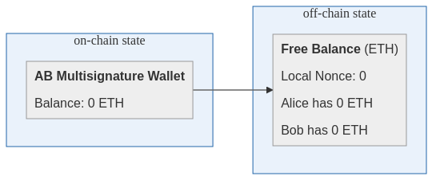

## Messages

After authentication and initializing a connection, channel establishment may begin. All state channels must run the Setup Protocol before any other protocol to "initialize" the channel. As the name suggests, its purpose is to setup the counterfactual state such that later protocols can be executed correctly.

Specifically, the Setup Protocol exchanges a commitment allowing a particular off-chain application to withdraw funds from the multisignature wallet. We call this application the Free Balance application, representating the available funds for any new application to be installed into the state channel.

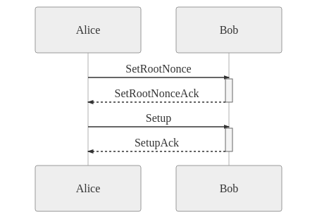

Unlike other protocols, there is no extra message data for the Setup Protocol because the commitment digests are deterministic on the addresses of the participants of the state channel. In every case, the protocol effectively installs the Free Balance application with starting balances of 0 for each participant. Thus, no extra data is required to be passed in from outside the context of the protocol execution.

### The **`SetRootNonce`** Message

| Field         | Description                      |
| ------------- | -------------------------------- |
| `protocol`    | `1`                              |
| `fromAddress` | The address of Alice             |
| `toAddress`   | The address of Bob               |
| `seq`         | `0`                              |
| `signature`   | Alice's signed commitment digest |

### The **`SetRootNonceAck`** Message

| Field         | Description                    |
| ------------- | ------------------------------ |
| `protocol`    | `1`                            |
| `fromAddress` | The address of Alice           |
| `toAddress`   | The address of Bob             |
| `seq`         | `1`                            |
| `signature`   | Bob's signed commitment digest |

### The **`Setup`** Message

| Field         | Description                                                 |
| ------------- | ----------------------------------------------------------- |
| `protocol`    | `1`                                                         |
| `multisig`    | The address of the on-chain Alice-Bob multisignature wallet |
| `data`        | `""`                                                        |
| `fromAddress` | The address of Alice                                        |
| `toAddress`   | The address of Bob                                          |
| `seq`         | `2`                                                         |
| `signature`   | Alice's signed commitment digest                            |

### The **`SetupAck`** Message

| Field         | Description                                                 |
| ------------- | ----------------------------------------------------------- |
| `protocol`    | `1`                                                         |
| `multisig`    | The address of the on-chain Alice-Bob multisignature wallet |
| `data`        | `""`                                                        |
| `fromAddress` | The address of Alice                                        |
| `toAddress`   | The address of Bob                                          |
| `seq`         | `3`                                                         |
| `signature`   | Bob's signed commitment digest                              |

## Commitments

**Commitment for `SetRootNonce` and `SetRootNonceAck`**:

The commitments that these two messages rely on have the following parameters:

| Parameter              | Type      | Description                                                      |
| ---------------------- | --------- | ---------------------------------------------------------------- |
| **`rootNonceTimeout`** | `uint256` | Relative timeout in seconds after which the root nonce finalizes |
| **`rootNonceSalt`**    | `bytes32` | Arbitrary value to facilitate uniqueness of the root nonce       |

The commitment can be visually represented like:

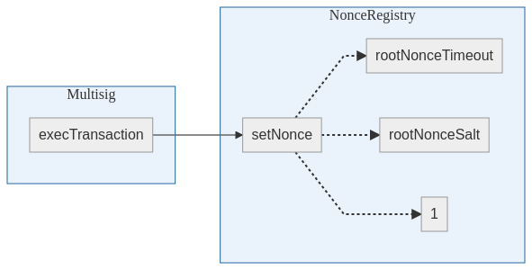

**Commitment for `Setup` and `SetupAck`**:

The commitments that these two messages rely on have the following explicit parameters:

| Parameter         | Type      | Description                                                                                                        |
| ----------------- | --------- | ------------------------------------------------------------------------------------------------------------------ |
| **`depNonceKey`** | `bytes32` | Arbitrary value that the installed free balance app's conditional transaction depends on inside the Nonce Registry |

Additionally, the following parameters are implicitly computed:

| Parameter          | Type      | Description                                                                                                                            |
| ------------------ | --------- | -------------------------------------------------------------------------------------------------------------------------------------- |
| **`terms`**        | `Terms`   | Set to the default value                                                                                                               |
| **`appCfAddress`** | `bytes32` | Set to the computed value for a counterfactual address of a `PaymentApp` with the initial signing keys of both users and default terms |

The commitment can be visually represented like:

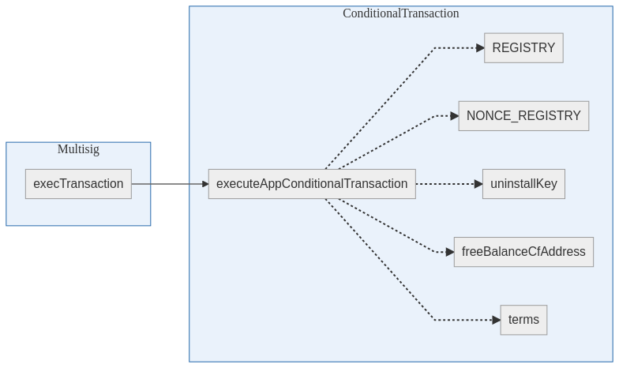

> NOTE: The usage of `MultiSend` in this commitment is redundant and should be removed.

# Install Protocol

To illustrate the install protocol, first assume that the multisignature wallet owns 20 ETH and that the Free Balance application has recorded a balance of 10 ETH for both for Alice and Bob. Running the install protocol allows Alice and Bob to install an application where Alice and Bob both deposit 1 ETH to be disbursed based on the resolution logic of the application.

In this example, the application is Tic-Tac-Toe. You can see with the visual representation below that the funds available in the free balance decrease and the funds committed to the Tic-Tac-Toe application increase by the corresponding amount.

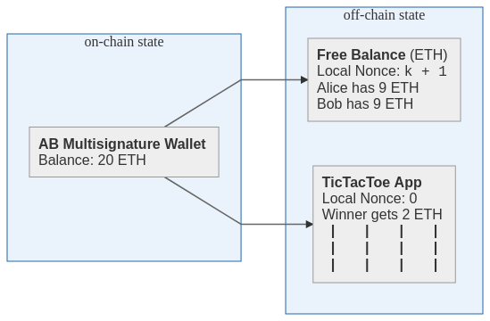


## Messages

When the application has been decided between both parties and a connection is established, the protocol for installing the application into the state channel is a single round-trip exchange of `Install` and `InstallAck` messages which include all information pertaining to the chosen deposit amounts of both parties, a pointer to the application being requested to be installed, and metadata such as the timeout and terms being agreed to.

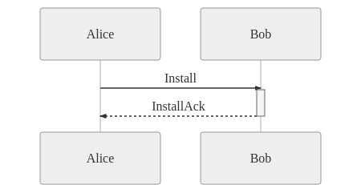

### Types

First we introduce a new type which we label `InstallData`.

**Type: `InstallData`**

| Field     | Type             | Description                                                        |
| --------- | ---------------- | ------------------------------------------------------------------ |
| `peer1`   | `PeerBalance`    | The proposed sub-deposit into the application of the first party   |
| `peer2`   | `PeerBalance`    | The proposed sub-deposit into the application of the second party  |
| `keyA`    | `address`        | The signing key that the first party will use for the application  |
| `keyB`    | `address`        | The signing key that the second party will use for the application |
| `terms`   | `Terms`          | The terms of agreement for this application                        |
| `app`     | `CfAppInterface` | The definition of the interface of the application to be installed |
| `timeout` | `uint256`        | The challenge period length for this application                   |

> NOTE: `keyA` and `keyB` are deterministically generated based on the nonce of the application in relation to the entire channel lifecycle. Further detail still to be provided in these specifications in the future. See [this issue](https://github.com/counterfactual/specs/issues/15) for discussion

> NOTE: At the moment, this message requires that the hexidecimal value of `peer1.address` is strictly less than the value of `peer2.address` to enforce deterministic ordering of the `signingKey` variable in new application installs. This can be improved in the future

### The **`Install`** Message

| Field         | Description                                                 |
| ------------- | ----------------------------------------------------------- |
| `protocol`    | `2`                                                         |
| `multisig`    | The address of the on-chain Alice-Bob multisignature wallet |
| `data`        | An `InstallData` object describing the proposed app         |
| `fromAddress` | The address of Alice                                        |
| `toAddress`   | The address of Bob                                          |
| `seq`         | `0`                                                         |
| `signature`   | Alice's signed commitment digest                            |

### The **`InstallAck`** Message

| Field         | Description                                                 |
| ------------- | ----------------------------------------------------------- |
| `protocol`    | `2`                                                         |
| `multisig`    | The address of the on-chain Alice-Bob multisignature wallet |
| `data`        | An `InstallData` object describing the proposed app         |
| `fromAddress` | The address of Alice                                        |
| `toAddress`   | The address of Bob                                          |
| `seq`         | `1`                                                         |
| `signature`   | Bob's signed commitment digest                              |

## Commitments

**Commitment for `Install` and `InstallAck`**:

Let `c1` and `c2` be the amounts that parties 1 and 2 wish to contribute towards the application respectively. Then, the commitment should:

- Updates the state of the free balance application to one where the first party's balance is reduced by `c_1` and party the second party's balance should be reduced by `c_2`.
- Makes a delegatecall to `executeAppConditionalTransaction` with a limit of `c_1 + c_2` as also included in the terms.

The following parameters are included in the commitment:

| Parameter          | Type      | Description                                                                                           |
| ------------------ | --------- | ----------------------------------------------------------------------------------------------------- |
| **`depNonceKey`**  | `bytes32` | Arbitrary value that the installed app's conditional transaction depends on inside the Nonce Registry |
| **`appStateHash`** | `bytes32` | The computed `keccak256` hash of the initial ABIEncoderV2 encoded state of the application            |

The commitment can be visually represented like:

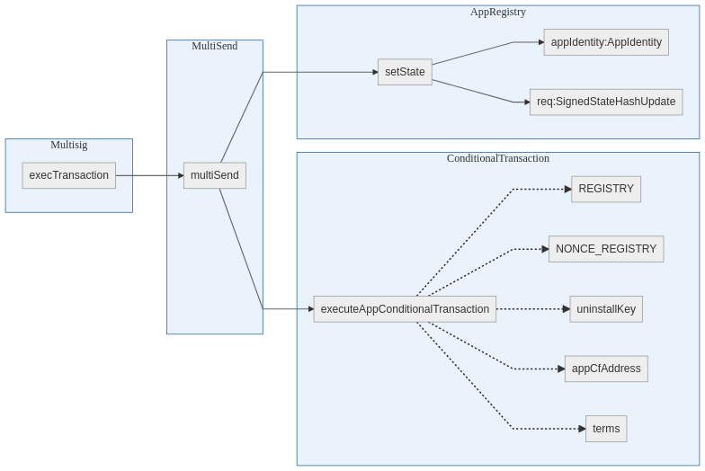


> NOTE: Although not shown in the visualization, the order of transactions is important. The `multiSend` must encode the call to `proxyCall` **before** the call to `executeAppConditionalTransaction`.

# SetState Protocol


Once an application has been installed into the state channel, the multisignature wallet has transferred control over the installed amount from the free balance to the application's `resolve` function, a mapping from application state to funds distribution. For example, in the case of Tic-Tac-Toe, a possible payout function is: if X wins, Alice gets 2 ETH, else if O wins Bob gets 2 ETH, else send 1 ETH to Alice and Bob.

As the underlying state of the application changes, the result of the payout function changes. It is the job of the Update Protocol to mutate this state, independently of the rest of the counterfactual structure.

Using our Tic-Tac-Toe example, if Alice decides to place an X on the board, Alice would run the Update Protocol, transitioning our state to what is represented by the figure above. Notice how both the board changes and the _local_ nonce for the app is bumped from 0 to 1. To play out the game, we can continuously run the update protocol, making one move at a time.

## Messages


For the below messages, the digest that is signed is represented as the following:

```typescript
keccak256(
  ["bytes1", "address[]", "uint256", "uint256", "bytes32"],
  [
    0x19, // Required for every sig digest (ERC 191)
    [ALICE_ADDRESS, BOB_ADDRESS], // Must be in sorted order
    app.localNonce, // A number higher than previously signed nonces
    timeout, // A timeout specific to this latest signed update
    appStateHash // The hash of the application state being set
  ]
);
```

### The **`SetState`** Message

| Field         | Description                                                                 |
| ------------- | --------------------------------------------------------------------------- |
| `protocol`    | `3`                                                                         |
| `cfAddress`   | The counterfactual address / unique identifier of the off-chain application |
| `data`        | An object containing the `bytes32` representation of the `appStateHash`     |
| `fromAddress` | The address of Alice                                                        |
| `toAddress`   | The address of Bob                                                          |
| `seq`         | `0`                                                                         |
| `signature`   | Alice's signed commitment digest                                            |

> TODO: Use the ABIEncoderV2 encoded application state instead of the `appStateHash`; without it the receiving client can't decode the message to determine whether or not to sign

> TODO: Add a field for the ABIEncoderV2 encoded action

### The **`SetStateAck`** Message

| Field         | Description                                                                 |
| ------------- | --------------------------------------------------------------------------- |
| `protocol`    | `3`                                                                         |
| `cfAddress`   | The counterfactual address / unique identifier of the off-chain application |
| `data`        | `""`                                                                        |
| `fromAddress` | The address of Alice                                                        |
| `toAddress`   | The address of Bob                                                          |
| `seq`         | `1`                                                                         |
| `signature`   | Bob's signed commitment digest                                              |

## Commitments

**Commitment for `SetState` and `SetStateAck`**:

The commitment can be visually represented like:

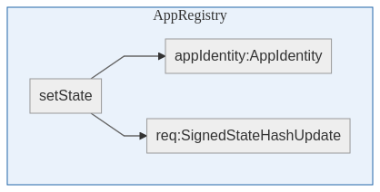

This transaction uses the global, on-chain Registry contract to translate the counterfactual address of the application into an on-chain address, and subsequently invoke the `setState` function with the signatures exchanged during the protocol.

# Uninstall Protocol


The lifecycle of an application completes when it reaches some type of end or "terminal" state, at which point both parties know the finalized distribution of funds in the application-specific state channel.

In the case of a regular application specific state channel, both parties might broadcast the application on chain, wait the timeout period, and then broadcast the execution of the Conditional Transfer, thereby paying out the funds on chain. In the generalized state channel context however, the post-application protocol is to transfer the funds controlled by the application back to the Free Balance application off chain, so that they could be reused for other off-chain applications.

Using our Tic-Tac-Toe example, imagine Alice made the final winning move, declaring X the winner. If Alice runs the Uninstall Protocol, then the Counterfactual state transitions to what is shown above.

## Messages


### The **`Uninstall`** Message

| Field         | Description                                                                       |
| ------------- | --------------------------------------------------------------------------------- |
| `protocol`    | `4`                                                                               |
| `cfAddress`   | The counterfactual address / unique identifier of the off-chain application       |
| `data`        | A object representing the updated balances of the of the free balance application |
| `fromAddress` | The address of Alice                                                              |
| `toAddress`   | The address of Bob                                                                |
| `seq`         | `0`                                                                               |
| `signature`   | Alice's signed commitment digest                                                  |

### The **`UninstallAck`** Message

| Field         | Description                                                                 |
| ------------- | --------------------------------------------------------------------------- |
| `protocol`    | `4`                                                                         |
| `cfAddress`   | The counterfactual address / unique identifier of the off-chain application |
| `data`        | `""`                                                                        |
| `fromAddress` | The address of Alice                                                        |
| `toAddress`   | The address of Bob                                                          |
| `seq`         | `1`                                                                         |
| `signature`   | Bob's signed commitment digest                                              |

## Commitments

**Commitment for `Uninstall` and `UninstallAck`**:

There are two key operations required for a successful uninstall.

- Set a new state on the Free Balance. The resolution function defined in the application must be run to compute an update to the Free Balance that is based on the outcome of the application.
- Set a new nonce on the Nonce Registry. As a result, the Conditional Transfer pointing at the original application will be invalidated and the application will be considered deleted.

Specifically, the Conditional Transfer commitment created by the Install Protocol checks that the dependency nonce does not equal 1. _If the nonce is ever 1_, then the conditional transfer will fail. Hence setting the nonce to 1 invalidates the conditional transfer, which is desired behaviour.

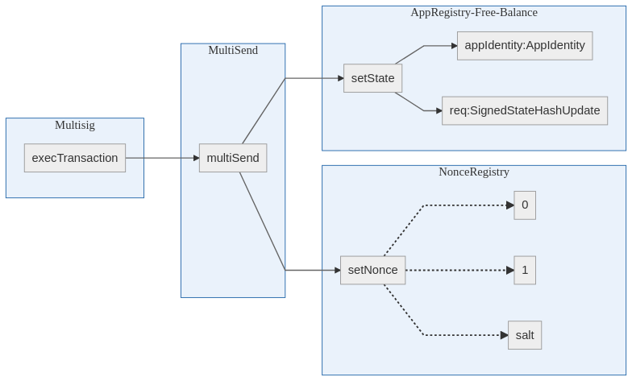

# Cleanup Protocol

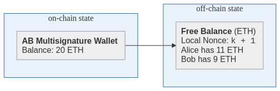

> NOTE: Notice that the `stale-invalid state` object has been removed from the previous figure shown in the [Uninstall Protocol](#uninstall-protocol) representing the effective "garbage collection" phenomena of the cleanup protocol

The cleanup protocol is a protocol that is periodically run to update the dependency of every active application to a newer root nonce version. In effect, it achieves the goal of O(1) constant time invalidation of outdated state put on-chain by resetting the state such that regardless of the number of historical / outdated apps that have been uninstalled, refuting their validitity on chain requires a single transaction.

## Messages

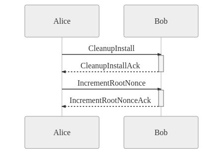

> NOTE: The dependency in the message exchange is important; it is not safe to sign the root nonce commitment without possession of all the active app commitments.

### The **`CleanupInstall`** Message

| Field         | Description                      |
| ------------- | -------------------------------- |
| `protocol`    | `5`                              |
| `fromAddress` | The address of Alice             |
| `toAddress`   | The address of Bob               |
| `seq`         | `0`                              |
| `signature`   | Alice's signed commitment digest |

### The **`CleanupInstallAck`** Message

| Field         | Description                    |
| ------------- | ------------------------------ |
| `protocol`    | `5`                            |
| `fromAddress` | The address of Alice           |
| `toAddress`   | The address of Bob             |
| `seq`         | `1`                            |
| `signature`   | Bob's signed commitment digest |

## Commitments

**Commitments for `CleanupInstall` and `CleanupInstallAck`**:

For each active application, a similar commitment to the one described in the [Install Protocol](#install-protocol) must be generated. The commitment calls `executeAppConditionalTransaction` with a limit of `c_1 + c_2` and a expected root nonce key of `r + 1`. Note that this is different from the install commitment in that it is not a multisend and does not set the free balance. Note that the free balance is also considered an active app. Here is an example of a commitment for a given app:

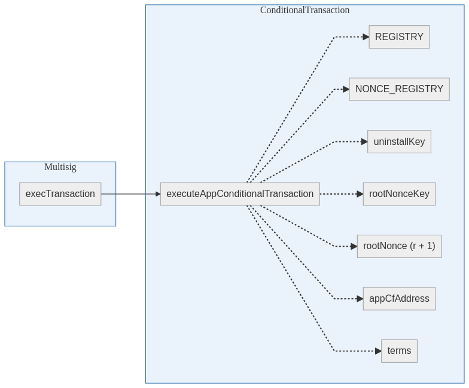

Then, finally, the commitment update the root nonce is simply:

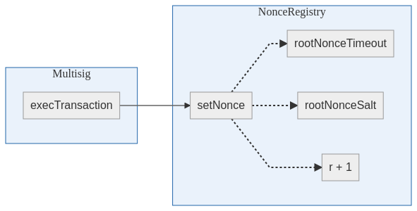