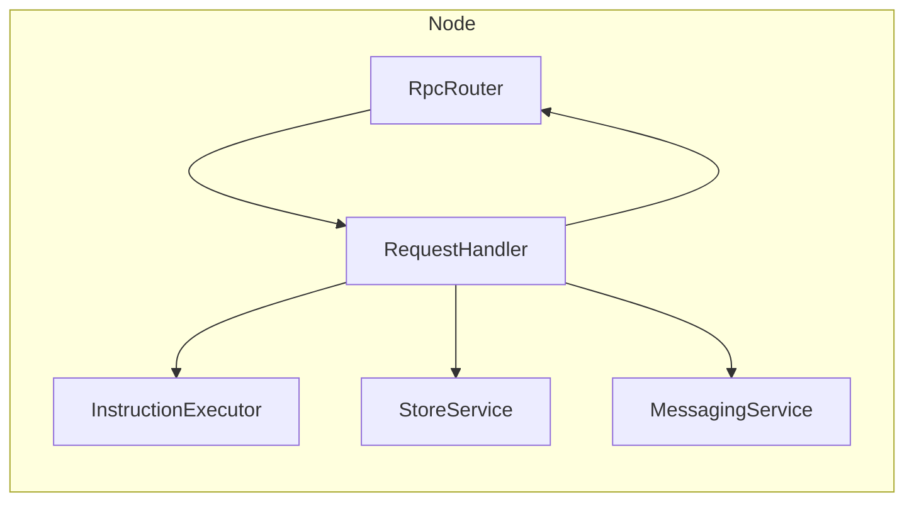
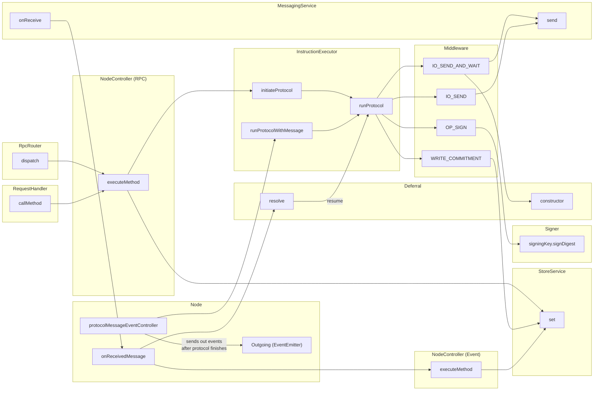

Here are some diagrams to help you understand the node.

If you are reading this on github.com, please use this Chrome extension to render the diagrams: https://chrome.google.com/webstore/detail/mermaid-diagrams/phfcghedmopjadpojhmmaffjmfiakfil

Ownership - arrows indicate "has a pointer to"

Control Flow - arrows mostly indicate "calls"

