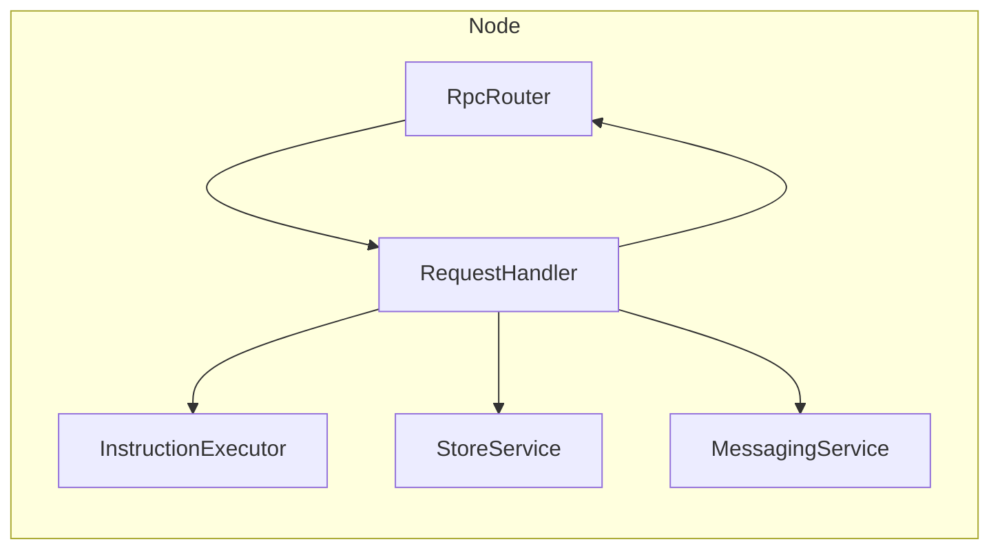
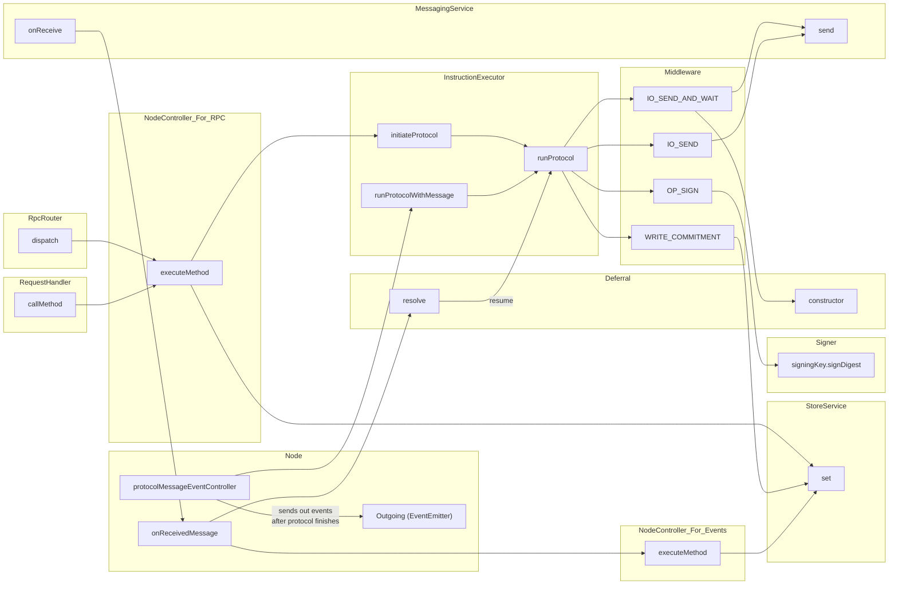

## Diagrams

These diagrams are available to help you understand the underlying architecture of the Node.

If you are reading this on GitHub, please use either of these Chrome extensions to render the diagrams: 

- [mermaid-diagrams](https://chrome.google.com/webstore/detail/mermaid-diagrams/phfcghedmopjadpojhmmaffjmfiakfil)
- [mermaid](https://chrome.google.com/webstore/detail/github-%20-mermaid/goiiopgdnkogdbjmncgedmgpoajilohe)

### Ownership
> arrows indicate "has a pointer to"

### Control Flow
> arrows mostly indicate "calls"

