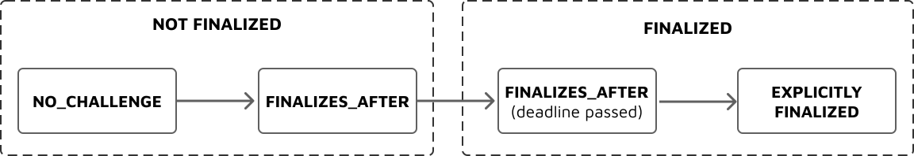

# Adjudication Layer

Counterfactual's adjudication layer uses a singleton contract called the [`ChallengeRegistry`](https://github.com/counterfactual/monorepo/blob/master/packages/cf-adjudicator-contracts/contracts/ChallengeRegistry.sol). This contract has been designed to only be compatible with applications that implement the [`CounterfactualApp`](https://github.com/counterfactual/monorepo/blob/master/packages/cf-adjudicator-contracts/contracts/interfaces/CounterfactualApp.sol) interface.

The adjudication layer treats off-chain state as divided into independent app instances, which are "instantiations" of Apps governed by the app definition. A channel with two chess different chess games ongoing has two different app instances.

Three core concepts of the adjudication layer are **challenges**, **outcomes** and **interpreters**. Challenges are the adjudication layer's mechanism to _learn the final state_ of an off-chain application. This final state is stored as an outcome. Interpreters use the outcome in order to _distribute state deposits_. As a concrete example, a challenge might be about the state of the board in a game of Tic-Tac-Toe, the outcome about who has won the game, and the interpreter produce the effect of sending 2 pre-committed ETH to the winner.

## AppInstance and AppIdentity

An app instance is uniquely identified by its `AppIdentity`.

```solidity
struct AppIdentity {
  uint256 channelNonce;
  address[] participants;
}
```

- **`participants`**: These are the keys expected to have signed any state updates that are meant to be validated by the `ChallengeRegistry`.

- **`channelNonce`**: A number used to identify uniqueness of the AppInstance

The hash of the app identity, defined as `keccak256(abi.encode(appIdentity.channelNonce, appIdentity.participants))`, uniquely identifies the app instance as well.

## Challenges

A challenge that is put on-chain must result from a failure of some state channel users to follow the protocol. In most cases, it represents a failure of responsiveness.

### Data Structure

The `ChallengeRegistry` contains a storage mapping from appIdentityHash to a struct that represents the current challenge the app instance is undergoing

```solidity
 mapping (bytes32 => LibStateChannelApp.AppChallenge) public appChallenges;
```

A challenge is represented by the following data structure:

```solidity
struct AppChallenge {
    ChallengeStatus status;
    address latestSubmitter;
    bytes32 appStateHash;
    uint256 challengeCounter;
    uint256 finalizesAt;
    uint256 versionNumber;
}
```

Where `ChallengeStatus` is one of `NO_CHALLENGE`, `EXPLICITLY_FINALIZED`, or `FINALIZES_AFTER_DEADLINE`.

Here is a description of why each field exists in this data structure:

- **`status` and `finalizesAt` **: A challenge exists is either "not finalized" or "finalized". A timeout is used as one transition between these two states. These two fields together determine if the channel is currently finalized and if there is a timeout running.

  - `NO_CHALLENGE`: Has never been opened (the "null" challenge and default for all off-chain apps)
  - `FINALIZES_AFTER_DEADLINE`, `finalizesAt` in future: open and can be responded to
  - `FINALIZES_AFTER_DEADLINE`, `finalizesAt` in past: timeout expired, the challenge was finalized
  - `EXPLICITLY_FINALIZED`: Was finalized via a transition to an `is_final` state



- **`latestSubmitter`**: This is a record of _who_ submitted the last challenge. This is useful to ensure that if a [provably malicious](#provably-malicious-challenges) challenge was submitted, the malicious party can be punished.

- **`appStateHash`**: This is the hash of the latest state of the application. We only need to store the hash of the latest state in the event of a challenge because it is possible to accept the full state as calldata, hash it in the EVM, and then compare this to the hash and keep the full state available in calldata to be used for computation.

- **`versionNumber`**: This is the versionNumber (i.e., the monotonically increasing version number of the state) at which the `appStateHash` is versioned for a particular challenge.

- **`challengeCounter`**: The `challengeCounter` is a permanent marker of how many times a challenge has been issued and re-issued on-chain for a particular AppInstance. Parties can pre-agree that if this counter ever reaches an excessively high number, simply conclude the application at some pre-determined outcome. This is simply a special mechanism to conclude applications in cases of excessive griefing by one counterparty. For more information, I recommend reading the [economic risks](https://github.com/counterfactual/paper/blob/master/main.tex#L343) section of the [Counterfactual paper](https://l4.ventures/papers/statechannels.pdf).

Since the contract that Counterfactual relies on for managing challenges is a singleton and is responsible for challnges that can occur in multiple different state channels simultaneously, it implements a mapping from what is called an `AppIdentity` to the challenge data structure described above.

### Initiating a Challenge

**Counterparty is unresponsive**. In the event that one user becomes unresponsive in the state channel application, it is always possible to simply submit the latest state of the application to the `ChallengeRegistry` contract. This requires submitting an `AppIdentity` object, the hash of the latest state, its corresponding versionNumber, a timeout parameter, and the signatures required for those three data. This initiates a challenge and places an `AppChallenge` object in the storage of the contract assuming all of the information provided is adequate.

**Counterparty is unresponsive _and_ a valid action exists**. In the case that an application adheres to the `AppDefinition` interface and provides valid `applyAction` and `getTurnTaker` functions, an action can additionally be taken when initiator a challenge. A function call to the `ChallengeRegistry` with the latest state parameters exactly as in the case above but with an additional parameter for an encoded action and the requisite signatures by the valid turn taker can be made. In this case, a challenge is added the same as above but the state is progressed one step forward.

### Responding to a Challenge

**Cancelling the challenge**. In the simplest case, you and your counterparty can always sign a piece of data that declares "we would both like to cancel this challenge and resume off-chain". In this case, simply provide the contract with this evidence and the challenge can be deleted and ignored.

**Progressing the challenge on-chain**. If the counterparty that initiated the challenge is not willing to continue the application off-chain, but their challenge is indeed a valid one (perhaps you were offline temporarily), then you can respond to the challenge on-chain (and in doing so, issue a new challenge) if there exists an implementation for `applyAction` and `getTurnTaker`. In this case, much like is the case when initiator a challenge, you simply provide an encoded action and requisite signatures to re-issue the challenge but in the opposite direction.

**Handling a malicious challenge**. If the counterparty submitted stale state that is [provably malicious](#provably-malicious-challenges), then the contract supports claiming this by submitting a provably newer state that convicts them and rewards the honest party (i.e., you in this case).

## Outcomes

After a challenge has been finalized, the `ChallengeRegistry` can now be used to arrive at an outcome. In the Counterfactual protocols, it is the _outcome_ of an application that is important in executing the disribution of blockchain state fairly for any given off-chain application.

### Setting an Outcome

**After a challenge is finalized**. If a challenge has been finalized by the timeout expiring, then a function call can be made to the `ChallengeRegistry` that then initiates a call to the `computeOutcome` function of the corresponding `AppDefinition` to the challenge. The `computeOutcome` method will return a `bytes` struct and that is then stored inside the contract permanently as the outcome of the application.

**In the same transaction as finalizing a challenge.** A minor efficiency can be added here, but has not yet been implemented, which is that if the challenge can finalized unilaterally (either in initiation or in refutation) then it is possible to instantly set the outcome. There is an [issue tracking this on GitHub](https://github.com/counterfactual/monorepo/issues/1311).

## Interpreters

Interpreters read outcomes in order to produce an effect. The interpreter must be compatible with the outcome type of the application as defined in the [app definition](./app-definition.md).

Two interpreters are currently defined, although more can be added independently by add

- TwoPartyFixedOutcomeInterpreter splits a fixed amount of ETH based on a TwoPartyFixedOutcome. The parameters consist of two beneficiary addresses and the total amount of Eth, and the params are encoded as `tuple(address[2], uint256)`.
- MultiAssetMultiPartyCoinTransferInterpreter sends ETH based on an CoinTransfer outcome, up to a fixed upper bound. The paramse are encoded as `uint256`.

The interpreter used and the params to the interpreter are fixed per app instance by being included in the appIdentityHash computation. After an outcome is stored, the adjudication layer allows a commitment to `ConditionalTransactionDelegateTarget.sol:executeEffectOfInterpretedAppOutcome` call the intepreter on the outcome.

## FAQ

**Why are the contracts only compatible with the state channel framework?**

The core concepts are agnostic to the underlying interface that a state channels application might implement. A future version of the `ChallengeRegistry` might support other types of state channel architectures such as [Force Move Games](https://github.com/magmo/force-move-games), for example.

**Can an outcome be part of the application state itself?**

From a conceptual point of view, we think it is important to separate these two concepts. However, from an engineering point of view it can be more efficient to group the two together in a single state object. To be specific, if the outcome of an off-chain application is a agnostic to blockchain state (i.e., `pure`) operation on the state of the application, then it is safe to group the two together. However, if the outcome has a dependancy on an external contract or the block number (i.e., a `view` function) then the outcome _must_ be separately computed at a later time on-chain.

**Can participants sign new state off-chain during an on-chain challenge?**

It is possible that an application may have a challenge initiated on-chain and then have some state updated correctly off-chain. This would likely only occur in the case of a software error, but nonetheless it is possible. In this situation, whatever state has been put on-chain at some versionNumber `k` is considered to be _more valid_ than any off-chain signed state at versionNumber `k`. In order to progress the state off-chain, you would need to sign a new state with versionNumber `k + 1`.

**Can we punish stale state attacks?**

A challenge for an `n`-party off-chain application is considered to be provably malicious if the `versionNumber` of the challenge was `k` and someone was able to respond with a state signed by the `latestSubmitter` where the `versionNumber` of _that challenge response_ was at least `k + 2`.

The reason why the same version of the above scenario with `versionNumber` equal to `k + 1` is not considered malicious is that the following situation might occur by an honest party:

- Honest party A signs state with versionNumber `k` and send it to B. Then, B countersigns and sends to A
- Honest party A signs state with versionNumber `k + 1` and send it to B, Then, B is unresponsive

In this situation, honest party A holds a signed copy of state with versionNumber `k` signed by B and can initiate a challenge on the blockchain. However, it is possible that B did in fact receive the signed state with versionNumber `k + 1` and can then respond to the challenge with this. Therefore, we must require that a state put on chain have at least `k + 2` to be considered an attempt at a stale state attack.

**Where is the mapping from app definition to outcome type stored?**

Currently, this is stored on the app definition contract. In the future, it should be stored off-chain.
