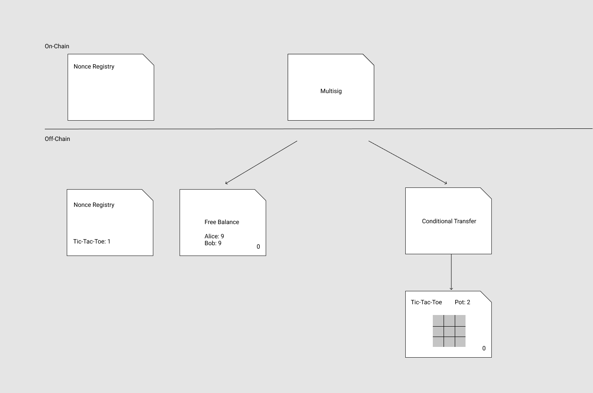

# Counterfactual Protocol

Counterfactual is the set of all protocols that can be communicated to handle the usage of off-chain applications pertaining to an on-chain state deposit. The current most up-to-date list of protocols is: [`setup`](#setup), [`install`](#install), [`setstate`](#setstate), [`uninstall`](#uninstall).

A protocol consists of the following components:

- **Handshake**. The protocol handshake is the series of messages exchanged between all parties in the state channel, as well as dependencies between messages. We write the handshake in a table; each message depends on the rows above it (i.e., the sender will not send the message until all the above messages have been sent/received), and each column represents the sender of the message.
- **Message**. A message is the set of information that must be exchanged by the parties to recreate (and validate) the commitment signatures and associated transactions that those signatures enable. Each protocol may in general contain multiple message types.
- **Commitments**. A protocol produces one or more commitments. The commitments (both the signature and the data) must be stored.

> Note: Messages are represented as JSON-encoded objects; the transport layer should be able to reliably send and receive such messages.

> Note: some data required for signature verification is _not_ present in these messages but is deterministically generated by each party. For example, [`setNonce`](https://github.com/counterfactual/monorepo/blob/master/packages/contracts/contracts/NonceRegistry.sol#L42) requires a salt, which is a monotonically increasing counter on the number of applications in a channel.

## Table of Contents

- [Structure](#structure)
- [Criteria](#criteria)
- [Protocols](#protocols)
  - [Setup](#setup)
  - [Install](#install)
  - [SetState](#setstate)
  - [Uninstall](#uninstall)

## Structure

### Commitments

In our codebase, a `CfOperation` is a class that specifies a commitment type, in other words, a type of transaction. A given `CfOperation` will fix most of the structure of the transaction but accept a small number of parameters (passed into the constructor). Given a `CfOperation` instance, the `hashToSign` function will return a `bytes32` digest that all signatories must sign, and those signatures can be passed into the `transaction` function, to return a transaction.

### Commitment Structrue

- The cryptographic _signature_ over some hash representing the transaction to be executed
- The _data_ that allows any party in the channel to reconstruct the hash and thus verify the signature

- **Transaction digest**. The transaction digest is the hash that is signed by each party, enabling the protocol's transaction to be executed on-chain. The calldata, if present, is used to generate the digest.
- **Transaction**. The transaction is the `(to, val, data, op)` tuple that a given protocol allows one to broadcast on-chain. These transactions enforce commitments created from the calldata and signature digests, manifesting the off-chain counterfactual state into the on-chain reality.

### Multisig Creation

Assume there exists a multisig shared by two parties, Alice and Bob.

The state of our state channel looks like this (note everything above the line is "on-chain" and everything below the line is "off-chain"):


With this multisig, we can begin running the Counterfactual Protocols to update our off-chain state.

## Criteria

This is a list of criteria for proposed protocol designs, i.e., predicates that a protocol design either satisfies or does not.

### One round trip communication

In a 2-party channel, 2 messages suffice to safely change the counterfactual state of the GSC

- to install an application.
- to uninstall an application.
- to update the state of an application.

### Constant sized communication

The total size of messages that we need to exchange to do the following has a constant size, in particular, independent of number of active or historical apps.

- to install an application.
- to uninstall an application.
- to update the state of an application.

Note: this criteria does not preclude a "cleanup phase" following the one round trip

### O(1) response

It is possible to arrive at a state where any stale-state-griefing attack can be responded to with a single transaction of constant size, in particular, independent of number of active or historical apps.

## Protocols

### Setup

The very first protocol every state channel must run is the Setup Protocol. As the name suggests, its purpose is to setup the counterfactual state so that later protocols can execute properly. Specifically, it exchanges a commitment allowing a special type of application to withdraw funds from the multisig. We call this application the Free Balance contract, representating the available funds for any new application to be installed into the state channel.

Completing the Setup Protocol transitions the counterfactual state to:


**Handshake:**

| A       | B          |
| ------- | ---------- |
| `Setup` |            |
|         | `SetupAck` |

**Message:**

```typescript
let Setup = {
  protocol: 1,
  multisig: address,
  data: None,
  fromAddress: address,
  toAddress: address,
  seq: 0,
  signature: signature
};
let SetupAck = {
  protocol: 1,
  multisig: address,
  data: None,
  fromAddress: address,
  toAddress: address,
  seq: 1,
  signature: signature
};

Setup.fromAddress === SetupAck.toAddress;
Setup.toAddress === SetupAck.fromAddress;
```

Unlike the rest of the protocols, there is no extra message data for the Setup protocol because it is deterministic. It always installs a Free Balance contract with starting balances of 0, and so no extra data is required to be passed in from outside the context of the protocol execution.

### Commitment

TBD

## Install

Assume the multisig owns 20 ETH and that the Free Balance has recorded a balance of 10 ETH for both for Alice and Bob.

Running the install protocol allows them to play a game of Tic-Tac-Toe where Alice and Bob both bet 1 ETH transitions the counterfactual state to



The funds available in the free balance decrease and the funds committed to the tic-tac-toe application increase by the corresponding amount.

### Commitment

Let `c_1`, `c_2` be the amount that parties 1 and 2 wish to contribute towards the application. The commitment

- updates the free balance state to one where party 1's balance is reduced by `c_1` and party 2's balance is reduced by `c_2`.
- sets the nonce registry entry to 1.
- calls `executeAppConditionalTransaction` with a limit of `c_1 + c_2`.

### Handshake

| A         | B            |
| --------- | ------------ |
| `Install` |              |
|           | `InstallAck` |

### Message

```typescript
Terms = {
  assetType: number,
  limit: number,
  token: address
};
CfAppInterface = {
  address: address,
  applyAction: bytes4,
  resolve: bytes4,
  getTurnTaken: bytes4,
  isStateTerminal: bytes4,
  abiEncoding: string
};
PeerBalance = {
  address: address,
  balance: uint256
};
InstallData = {
  peer1: PeerBalance,
  peer2: PeerBalance,
  keyA: address, // app-specific ephemeral key
  keyB: address,
  terms: Terms,
  app: CfAppInterface,
  timeout: number
};
Install = {
  protocol: 4,
  multisig: address,
  data: InstallData,
  fromAddress: address,
  toAddress: address,
  seq: 0,
  signature: signature
};
InstallAck = {
  protocol: 4,
  multisig: address,
  data: InstallData,
  fromAddress: address,
  toAddress: address,
  seq: 1,
  signature: signature
};
```

### Notes

It's important to observe that both peers on the `InstallData` object hold the following relationship:

```
InstallData.peer1.address < InstallData.peer2.address;
```

Why? When transactions are submitted, it is necessary to ensure that the on-chain signatures are from all the multisig's owners. In order to prevent a potential attack (by submitting an array of _n_ signatures by _m < n_ people with non-unique values and no exact mapping to the set of _n_ owners of the multisig), the `<` relation enforces ordering the signatures.


### Main Files

- `install-proposer.ts`
- `cf-op-install.ts`

see also: `MultiSend.sol` for how multisend transactions are decoded

### Commitment

#### Parameters

- `freeBalance.cfAddress`
- `freeBalance.appStateHash`
- `freeBalance.localNonce`
- `freeBalance.timeout`
- `salt`
- `key`
- `app.cfAddress`
- `assetType`
- `limit`
- `token`

#### Transaction

```typescript
delegatecall(
  (to = MULTISEND_ADDRESS),
  (val = 0),
  (data =
    encodeArgs(
      /* set FreeBalance state */
      ("uint256", "address", "uint256", "bytes"),
      [
        1,
        REGISTRY_ADDRESS,
        0,
        encode(
          "proxyCall(address,bytes32,bytes)"[
            (REGISTRY_ADDRESS,
            freeBalance.CfAddress,
            encode("setState(bytes32,uint256,uint256,bytes)", [
              freebalance.appStateHash,
              freeBalance.localNonce,
              freeBalance.timeout,
              0x00
            ]))
          ]
        )
      ]
    ) +
    encodeArgs(
      /* do conditional transfer */
      ("uint256", "address", "uint256", "bytes"),
      [
        1,
        CONDITIONAL_TRANSFER,
        0,
        encode(
          "executeAppConditionalTransaction(address,address,bytes32,uint256,bytes32,tuple(uint8,uint256,address))",
          [REGISTRY, NONCE_REGISTRY, key, app.cfAddress(assetType, limit, token)]
        )
      ]
    ))
);
```

## SetState

Once an application has been installed into the state channel, the multisig has transferred control over the installed amount from the free balance to the application's payout function, a mapping from application state to funds distribution. For example, in the case of Tic-Tac-Toe, a possible payout function is: if X wins, Alice gets 2 ETH, else if O wins Bob gets 2 ETH, else send 1 ETH to Alice and Bob.

As the underlying state of the application changes, the result of the payout function changes. It is the job of the Update Protocol to mutate this state, independently of the rest of the counterfactual structure.

Using our Tic-Tac-Toe example, if Alice decides to place an X on the board, Alice would run the Update Protocol, transitioning our state to


Notice how both the board changes and the _local_ nonce for the app is bumped from 0 to 1. To play out the game, we can continuously run the update protocol, making one move at a time.

### Handshake

| A        | B           |
| -------- | ----------- |
| `Update` |             |
|          | `UpdateAck` |

### Messsage

```typescript
Update = {
  protocol: 4,
  cfAddress: bytes32
  data: {
    appStateHash: bytes32
  },
  fromAddress: address,
  toAddress: address,
  seq: 0,
  signature: signature,
}
UpdateAck = {
  protocol: 4,
  cfAddress: bytes32
  data: None,
  fromAddress: address,
  toAddress: address,
  seq: 1,
  signature: signature,
}
```

### Main Files

- `cf-op-setstate.ts`

### Digest

```typescript
KECCAK256(
  ["bytes1", "address[]", "uint256", "uint256", "bytes32"],
  [
    0x19, // required for every sig digest (ERC 191)
    [ALICE_ADDRESS, BOB_ADDRESS], // must be in sorted order
    app.localNonce,
    timeout, // determined on installation
    appStateHash // given in UpdateData
  ]
);
```

### Commitment

#### Parameters

- `app.cfAddress`
- `app.stateHash`
- `app.localNonce`
- `timeout`

#### Transaction

```typescript
call(
  (to = REGISTRY_ADDRESS),
  (val = 0),
  (data = encode("proxyCall(address,bytes32,bytes)", [
    REGISTRY_ADDRESS,
    app.cfAddress,
    encode("setState(bytes32,uint256,uint256,bytes)", [
      app.stateHash,
      app.localNonce,
      timeout,
      signatures
    ])
  ]))
);
```

This transaction uses the global, on-chain Registry contract to translate the counterfactual address of the application into an on-chain address, and subsequently invoke the `setState` function with the signatures exchanged during the protocol.

## Uninstall

The lifecycle of an application completes when it reaches some type of end or "final" state, at which point both parties know the finalized distribution of funds in the application-specific state channel.

Now, both parties could simply broadcast the application on chain, wait the dispute period, and then broadcast the execution of the Conditional Transfer, thereby paying out the funds on chain. A better solution, however, is to transfer the funds controlled by the application back to the Free Balance contract off chain, so that they could be reused for other applications.

Using our Tic-Tac-Toe example, imagine Alice made the final winning move, declaring X the winner. If Alice runs the Uninstall Protocol, then the Counterfactual state transitions to


Notice the two operations here:

- set a new state on the Free Balance. Alice's balance in the Free Balance object was incremented by 2 ETH, repurposing the funds once owned by the Tic-Tac-Toe application.
- set a new nonce on the Nonce Registry. As a result, the Conditional Transfer pointing at Tic-Tac-Toe was invalidated, because we changed its associated entry in the NonceRegistry to 2.

Specifically, when we exchange commitments on the Conditional Transfer in the Install Protocol, we are exchanging signatures allowing us to execute a Conditional Transfer if and only if the nonce equals 1. _If the Nonce is ever not 1_, then the conditional transfer will fail, as desired in the Uninstall Protocol.

### Handshake

| A           | B              |
| ----------- | -------------- |
| `Uninstall` |                |
|             | `UninstallAck` |

### Message

```typescript
Uninstall = {
  protocol: 4,
  cfAddress: bytes32,
  data: {
    peerAmounts: [PeerBalance, PeerBalance]
  },
  fromAddress: address,
  toAddress: address,
  seq: 0,
  signature: signature
};
AckUninstall = {
  protocol: 4,
  cfAddress: bytes32,
  fromAddress: address,
  toAddress: address,
  seq: 1,
  signature: signature
};
```

### Transaction

```typescript
delegatecall(
  (to = MULTISEND_ADDRESS),
  (val = 0),
  (data =
    encodeArgs(
      /* set FreeBalance state */
      ("uint256", "address", "uint256", "bytes"),
      [
        1,
        REGISTRY_ADDRESS,
        0,
        encode(
          "proxyCall(address,bytes32,bytes)"[
            (REGISTRY_ADDRESS,
            freeBalance.CfAddress,
            encode("setState(bytes32,uint256,uint256,bytes)", [
              appStateHash,
              freeBalance.localNonce,
              freeBalance.timeout,
              0x00
            ]))
          ]
        )
      ]
    ) +
    encodeArgs(
      /* set dependency nonce */
      ("uint256", "address", "uint256", "bytes"),
      [
        0,
        NONCE_REGISTRY,
        0,
        encode("setNonce(uint256,byets32,uint256)", [0, salt, 1])
      ]
    ))
);
```
